# Mermaid 短视频制作文稿

## 🎨 视频封面设计

### 封面短标题选项

#### 方案一：直接型（推荐）
1. **用代码画图？这个神器让你秒变图表大师！**
2. **告别拖拽！70K+ 星标的图表神器 Mermaid**
3. **几行代码生成专业图表？Mermaid 太强了！**

#### 方案二：疑问型
1. **还在用鼠标画流程图？这个工具让你效率翻倍**
2. **GitHub 70K+ 星标！这个图表工具到底有多强？**
3. **为什么程序员都在用 Mermaid 画图？**

#### 方案三：数据型
1. **70,000+ 星标！20+ 种图表，Mermaid 全搞定**
2. **GitHub 爆款工具：用代码画 20+ 种专业图表**
3. **70K+ 开发者推荐：Mermaid 图表生成神器**

#### 方案四：对比型
1. **告别拖拽画图！Mermaid 用代码秒生成专业图表**
2. **还在用 Visio？试试这个免费的代码图表工具**
3. **鼠标画图太慢？Mermaid 让你用代码秒出图**

### 封面设计建议

#### 1. 视觉元素布局

**主视觉区（左侧 60%）：**
- 展示 2-3 个精美的 Mermaid 图表（流程图、序列图、甘特图等）
- 图表要有渐变色彩，视觉冲击力强
- 可以添加轻微的动画效果（如粒子、光晕）

**文字区（右侧 40%）：**
- 主标题：大号粗体，使用科技感字体（如 SF Pro、Inter Bold）
- 副标题：中号字体，突出关键数据（如 "70K+ ⭐"、"20+ 图表类型"）
- 装饰元素：代码符号（`{}`、`[]`、`<>`）作为背景装饰

#### 2. 配色方案

**方案 A：科技蓝（推荐）**
- 主色：深蓝色 (#1E3A8A) 或 渐变色 (#3B82F6 → #1E40AF)
- 辅助色：青色 (#06B6D4)、紫色 (#8B5CF6)
- 背景：深色背景 (#0F172A) 或 渐变背景
- 文字：白色/浅灰色，高对比度

**方案 B：活力橙**
- 主色：橙色 (#F97316) → 红色 (#EF4444) 渐变
- 辅助色：黄色 (#FBBF24)、粉色 (#EC4899)
- 背景：深灰 (#1F2937) 或 黑色
- 文字：白色，高对比度

**方案 C：清新绿**
- 主色：绿色 (#10B981) → 青色 (#14B8A6) 渐变
- 辅助色：蓝色 (#3B82F6)、紫色 (#8B5CF6)
- 背景：深色 (#111827)
- 文字：白色

#### 3. 具体设计元素

**必备元素：**
- ✅ Mermaid Logo 或 品牌标识（右上角或左下角）
- ✅ GitHub Star 数（如 "⭐ 70K+"，使用金色星星图标）
- ✅ 核心卖点文字（如 "代码画图"、"20+ 图表类型"）
- ✅ 图表预览（2-3 个不同类型的图表）

**可选元素：**
- 💡 代码编辑器界面（VS Code 风格）作为背景
- 💡 代码片段展示（如 `graph TD` 等）
- 💡 箭头、连接线等装饰元素
- 💡 粒子效果或光晕效果

#### 4. 文字排版建议

**主标题：**
- 字体大小：48-60px（根据平台调整）
- 字体：粗体，科技感字体
- 颜色：白色或亮色，带轻微阴影
- 位置：右侧上方或中央偏右

**副标题/数据：**
- 字体大小：24-32px
- 突出显示：GitHub Star 数、图表类型数量
- 使用图标：⭐、📊、🚀 等 emoji 或图标

**示例布局：**
```
┌─────────────────────────────────────┐
│  [图表1]  [图表2]  [图表3]          │
│                                     │
│           用代码画图？              │
│        这个神器让你秒变图表大师！    │
│                                     │
│      ⭐ 70K+  |  20+ 图表类型      │
│                                     │
│              Mermaid                │
└─────────────────────────────────────┘
```

#### 5. 平台适配建议

**B站/抖音/小红书：**
- 尺寸：1080x1920（竖屏）或 1920x1080（横屏）
- 文字要足够大，移动端可读
- 主标题控制在 15 字以内

**YouTube：**
- 尺寸：1280x720 或 1920x1080
- 可以更详细的信息
- 支持横屏布局

**通用建议：**
- 重要信息放在中央区域（安全区域）
- 避免文字太靠近边缘
- 使用高对比度，确保小尺寸下也清晰

#### 6. 设计工具推荐

- **Figma**：专业设计，支持协作
- **Canva**：模板丰富，快速出图
- **Photoshop**：精细调整
- **在线工具**：Remove.bg（去背景）、Coolors（配色）

#### 7. 封面设计检查清单

- [ ] 主标题清晰醒目，不超过 20 字
- [ ] 包含核心数据（GitHub Star 数、图表类型数）
- [ ] 展示 2-3 个精美的图表示例
- [ ] 配色协调，对比度足够
- [ ] 文字大小适合移动端阅读
- [ ] 重要信息在安全区域内
- [ ] 有 Mermaid 品牌标识或 Logo
- [ ] 整体风格科技感、专业感
- [ ] 符合平台尺寸要求
- [ ] 小尺寸预览也清晰可读

---

## 📹 视频脚本

### 【开场 - 30秒】

**画面：** 快速展示各种精美的 Mermaid 图表动画切换

**旁白：**
> "还在用鼠标拖拽画流程图吗？还在为复杂的图表工具而头疼吗？今天给大家介绍一个神器——Mermaid！只需要几行代码，就能生成专业级的图表。GitHub 上超过 70,000+ 星标，被无数开发者追捧，它到底有多强大？让我们一起来看看吧！"

---

### 【项目介绍 - 45秒】

**画面：** 展示 GitHub 页面，突出 star 数

**旁白：**
> "Mermaid 是一个基于文本的图表生成工具，它的核心理念是：用代码画图，而不是用鼠标拖拽。这意味着什么？意味着你可以像写代码一样，用纯文本描述图表，Mermaid 会自动帮你渲染成精美的可视化图表。
> 
> 它支持 20+ 种图表类型，从流程图到架构图，从甘特图到思维导图，应有尽有。而且，它完全免费、开源，可以直接集成到 GitHub、GitLab、Notion、飞书等平台，甚至可以在 Markdown 文档中直接使用。
> 
> 接下来，我会通过几个实际例子，展示 Mermaid 的强大功能。"

---

### 【功能展示 - 每个图表 30-40秒】

#### 1. 流程图 (Flowchart) - 展示复杂业务流程

**画面：** 展示流程图代码和渲染结果

**旁白：**
> "首先看流程图。这是电商订单处理的完整流程，包含了条件判断、并行处理、异常处理等复杂逻辑。用 Mermaid 只需要几十行代码就能清晰表达。"

**代码示例：**
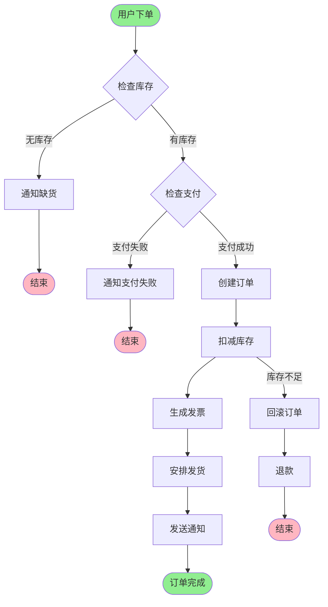

---

#### 2. 序列图 (Sequence Diagram) - 展示系统交互

**画面：** 展示序列图代码和渲染结果

**旁白：**
> "序列图可以清晰地展示系统之间的交互过程。这是一个用户登录的完整流程，涉及前端、后端、数据库、缓存等多个组件的协作。用 Mermaid 可以轻松表达这种时序关系。"

**代码示例：**
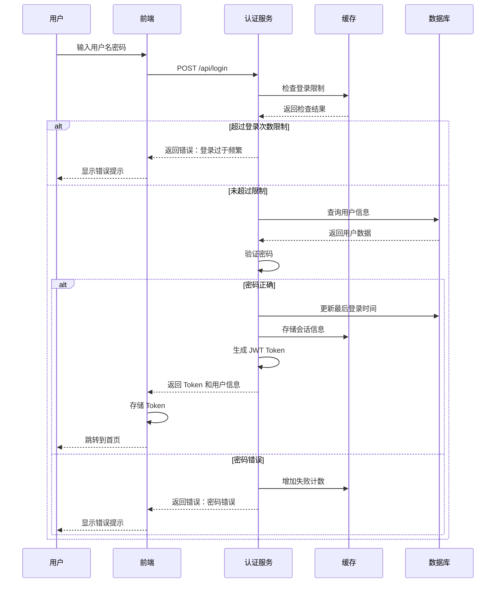

---

#### 3. 类图 (Class Diagram) - 展示系统架构

**画面：** 展示类图代码和渲染结果

**旁白：**
> "类图可以展示系统的面向对象设计。这是一个微服务架构的核心类结构，展示了各个服务之间的关系、继承和依赖。Mermaid 让复杂的架构设计变得一目了然。"

**代码示例：**
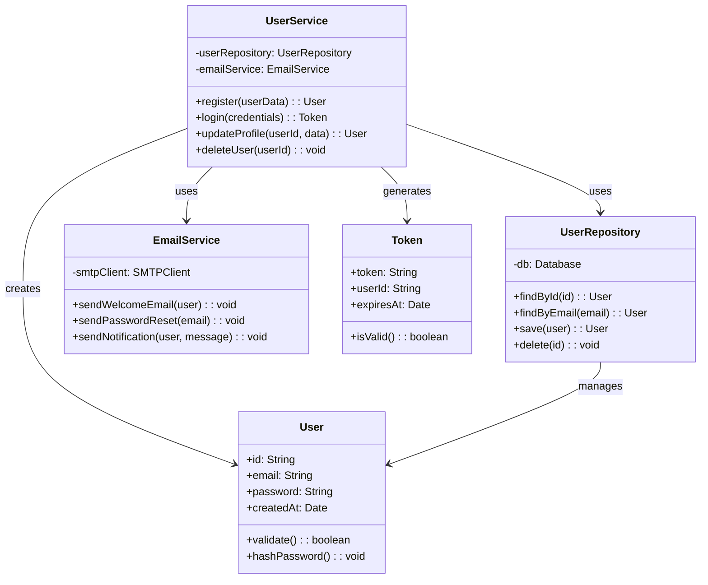

---

#### 4. 状态图 (State Diagram) - 展示状态转换

**画面：** 展示状态图代码和渲染结果

**旁白：**
> "状态图非常适合展示对象或系统的状态变化。这是一个订单状态机的完整流程，从下单到完成，包含了各种状态转换和条件判断。用 Mermaid 可以清晰地表达这种复杂的状态流转。"

**代码示例：**
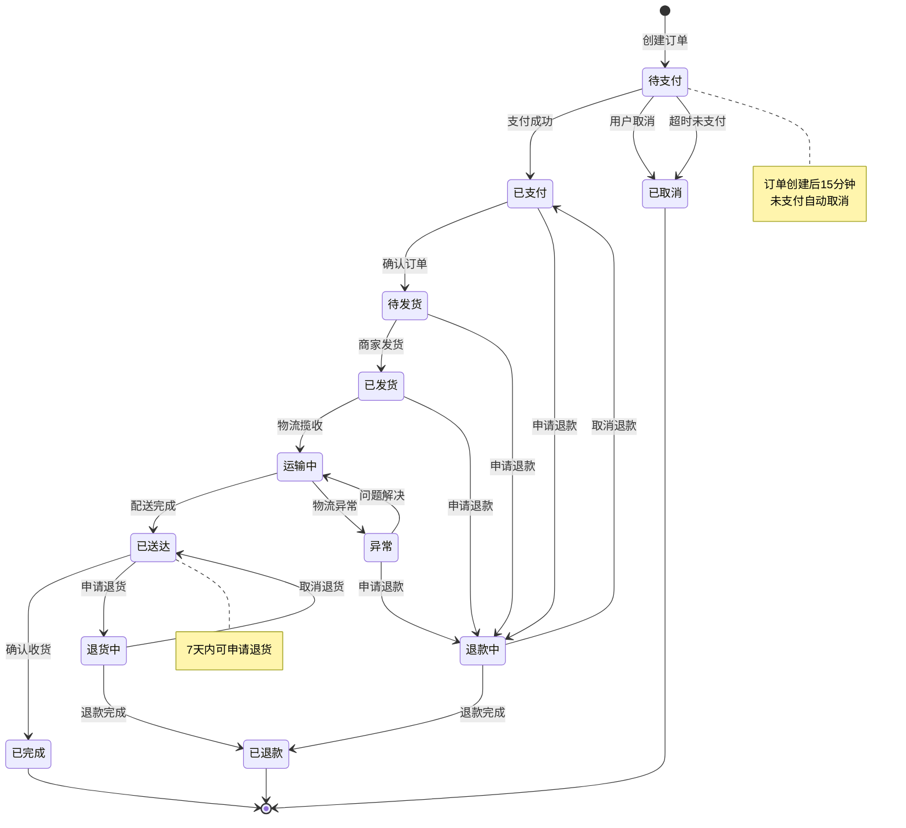

---

#### 5. 实体关系图 (ER Diagram) - 展示数据模型

**画面：** 展示 ER 图代码和渲染结果

**旁白：**
> "ER 图是数据库设计的必备工具。这是一个博客系统的数据模型，展示了用户、文章、评论等实体之间的关系。Mermaid 的 ER 图语法简洁直观，让数据库设计变得轻松。"

**代码示例：**
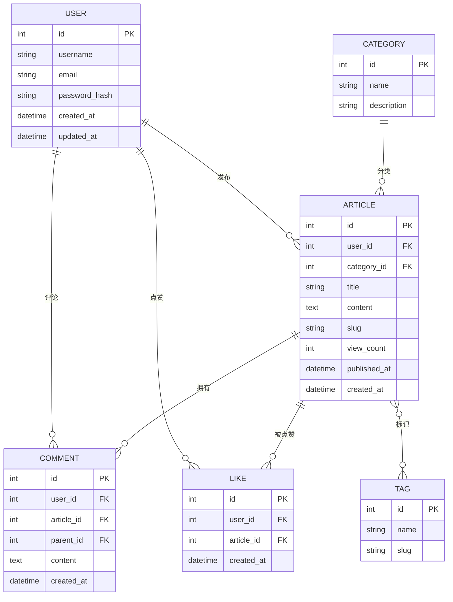

---

#### 6. 甘特图 (Gantt Chart) - 展示项目计划

**画面：** 展示甘特图代码和渲染结果

**旁白：**
> "甘特图是项目管理的神器。这是一个软件开发项目的完整时间线，展示了各个任务的时间安排、依赖关系和里程碑。用 Mermaid 可以轻松创建专业的项目计划图。"

**代码示例：**
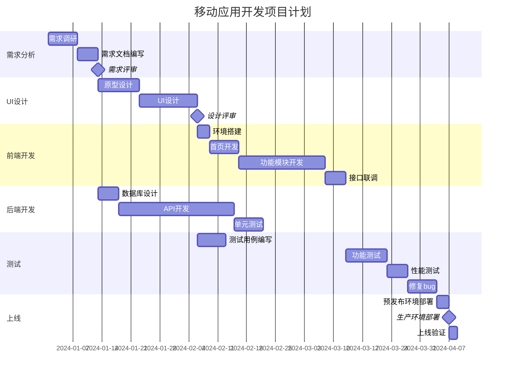

---

#### 7. 用户旅程图 (User Journey) - 展示用户体验

**画面：** 展示用户旅程图代码和渲染结果

**旁白：**
> "用户旅程图可以帮助我们理解用户的完整体验流程。这是一个在线购物的用户旅程，从浏览商品到完成购买，展示了每个阶段用户的情感变化和关键触点。Mermaid 让用户体验设计变得可视化。"

**代码示例：**
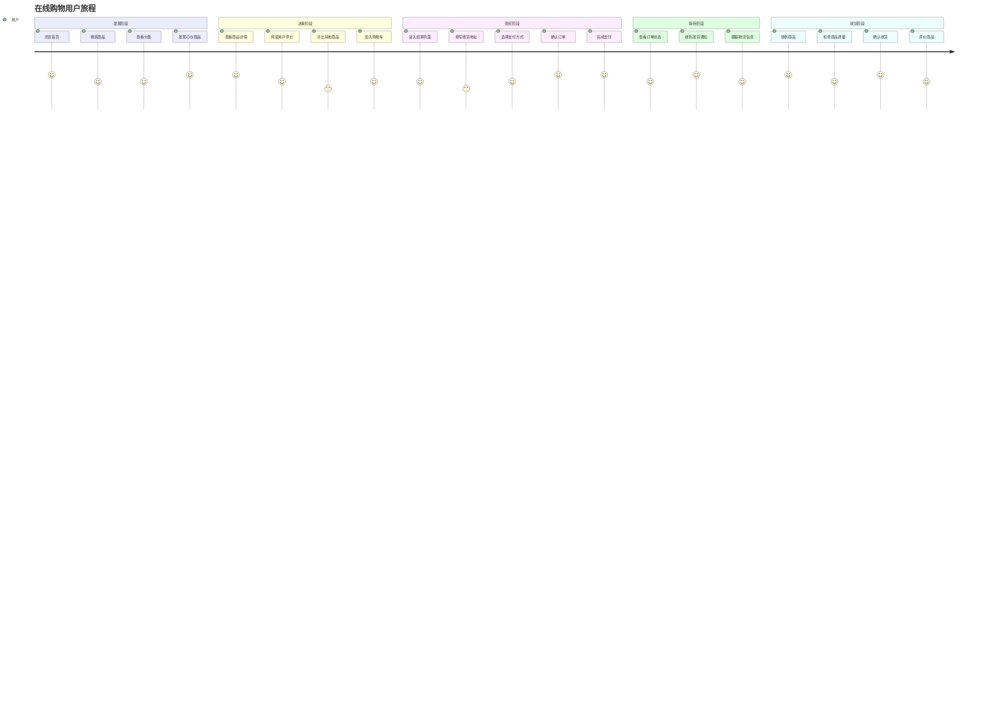

---

#### 8. Git 图 (Git Graph) - 展示版本控制

**画面：** 展示 Git 图代码和渲染结果

**旁白：**
> "Git 图可以可视化版本控制的分支和合并历史。这是一个典型的 Git 工作流，展示了主分支、开发分支、功能分支之间的关系。对于团队协作来说，这个功能非常实用。"

**代码示例：**
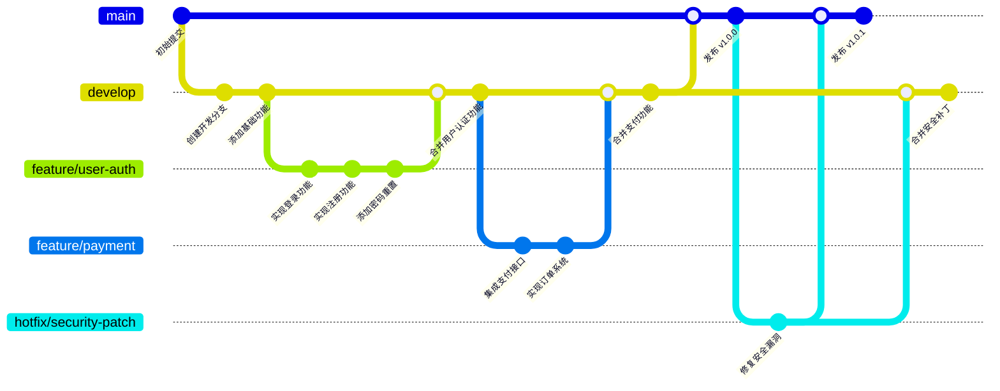

---

#### 9. 思维导图 (Mindmap) - 展示知识结构

**画面：** 展示思维导图代码和渲染结果

**旁白：**
> "思维导图可以帮助我们整理和展示知识结构。这是一个关于 Web 开发技术栈的思维导图，展示了前端、后端、数据库等各个技术领域。用 Mermaid 可以快速创建结构化的知识图谱。"

**代码示例：**
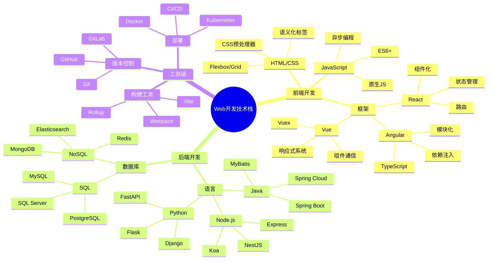

---

#### 10. 象限图 (Quadrant Chart) - 展示数据分析

**画面：** 展示象限图代码和渲染结果

**旁白：**
> "象限图非常适合做数据分析和决策。这是一个产品功能优先级分析图，通过重要性和紧急程度两个维度，将功能分为四个象限。Mermaid 让数据分析变得直观易懂。"

**代码示例：**
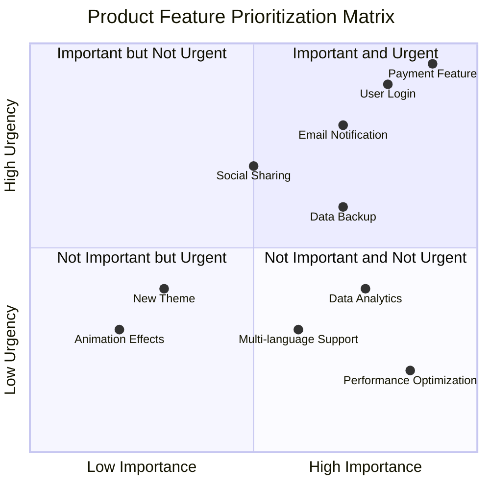

---

#### 11. 饼图 (Pie Chart) - 展示数据占比

**画面：** 展示饼图代码和渲染结果

**旁白：**
> "饼图是展示数据占比的经典图表。这是一个网站流量来源分析，展示了不同渠道的访问占比。Mermaid 的饼图语法简洁，可以快速生成专业的数据可视化图表。"

**代码示例：**
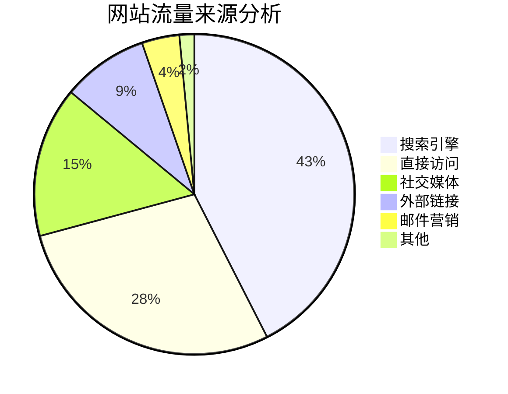

---

#### 12. 时间线图 (Timeline) - 展示历史事件

**画面：** 展示时间线图代码和渲染结果

**旁白：**
> "时间线图可以清晰地展示历史事件或项目里程碑。这是一个公司发展历程的时间线，展示了从成立到现在的关键节点。Mermaid 让时间线制作变得简单高效。"

**代码示例：**
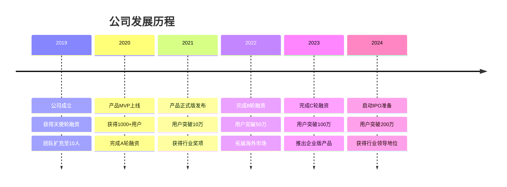

---

### 【总结 - 30秒】

**画面：** 快速回顾所有图表类型，最后展示 GitHub 页面

**旁白：**
> "看到了吗？Mermaid 就是这么强大！从流程图到架构图，从甘特图到思维导图，20+ 种图表类型，满足你所有的可视化需求。
> 
> 而且，它完全免费开源，GitHub 上超过 70,000+ 星标，被无数开发者和团队使用。无论是写技术文档、做项目规划，还是做数据分析，Mermaid 都能帮你快速生成专业级的图表。
> 
> 最重要的是，它基于文本，可以版本控制，可以团队协作，可以无缝集成到各种平台。不要再犹豫了，赶紧去试试吧！链接在评论区，记得一键三连哦！"

---

## 📝 制作要点

### 1. 视频节奏
- **开场**：快速、吸引人，展示视觉冲击力
- **介绍**：简洁明了，突出核心价值
- **展示**：每个图表 30-40 秒，保持节奏感
- **总结**：强化记忆点，引导行动

### 2. 画面建议
- 使用代码编辑器（VS Code）展示代码
- 使用 Mermaid Live Editor 展示渲染效果
- 代码和图表并排显示，形成对比
- 使用动画效果展示图表生成过程
- 最后展示 GitHub 页面，突出 star 数

### 3. 旁白技巧
- 语速适中，清晰有力
- 每个图表前先说明用途
- 强调 Mermaid 的简洁性和强大性
- 适当使用"只需要几行代码"、"轻松"、"简单"等词汇

### 4. 字幕建议
- 关键信息加字幕（如"70,000+ 星标"）
- 代码片段可以加字幕说明
- 图表类型名称加字幕

### 5. 背景音乐
- 选择轻快、科技感的背景音乐
- 音量控制在 30% 左右，不干扰旁白
- 在图表展示时可以使用轻微的转场音效

---

## 🎬 拍摄清单

- [ ] 准备所有图表的代码和渲染结果
- [ ] 录制代码编辑器画面
- [ ] 录制 Mermaid Live Editor 画面
- [ ] 录制 GitHub 页面（突出 star 数）
- [ ] 准备背景音乐
- [ ] 录制旁白（或使用 TTS）
- [ ] 添加字幕
- [ ] 添加转场动画
- [ ] 最终剪辑和调色

---

## 📊 图表代码文件

所有图表的完整代码已包含在本文档中，可以直接复制到 Mermaid Live Editor (https://mermaid.live/) 中预览和调整。

---

## 🎯 关键数据点

- **GitHub Stars**: 70,000+ (实际数字请查看最新数据)
- **图表类型**: 20+ 种
- **支持平台**: GitHub, GitLab, Notion, 飞书, Markdown 等
- **核心优势**: 文本驱动、版本控制、团队协作

---

**祝您视频制作顺利！记得在视频中强调 Mermaid 的实用性和易用性，相信会吸引很多开发者关注！** 🚀
